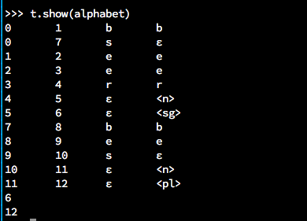

# Introduction
1. This repository is an initial attempt towards making a full fleged python wrapper for the Apertium Lttoolbox  module.
2. In this repository a trivial wrapping of the `transducer.cc` module has been attempted
3. Contents of the repository :
	* Nessecary header files
	* Nessecary `.cc` files
	* `setup.py` Disuitls file to set things up for building the wrapper
	* `bugs.md` Description of bugs and faults with this trivial system and a little insight on how to proceed with the project.
	* `transducer.i` The swig interface file
	* `transducer.py` and `transducer.cxx` These are generated files and can be generated by building
	* `.o` and `.so` files . These object and shared object files are also generated from the build

# Steps to Build

1. `git clone repo`
2. `cd repo`
3. `swig -python -c++ transducer.i`
4. `python setup.py build_ext --inplace`
5. `g++ -c -fcip transducer_wrap.cxx transducer.cc -I/{{path to python header}} -std=c++11`
6. `g++ -shared transducer.o transducer_wrap.o -o _transducer.so `pkg-config --cflags --libs python3 lttoolbox` -std=c++11`

### Alternate
1. `chmod +x run.sh`
2. `./run.sh`

# Steps to Run

1. After the above steps are completed just open python in the terminal and try to `import transducer`
2. Make sure to run the appropriate version of python

# Note

1. To get the  path to python header in the  environment, enter `python-config --cflags` in the terminal

# Current Status of the wrapper
 - The current wrapper can take a transducer as input(ref `test.py`)
 - `t.show()` gives the following output for a transducer for beer:

        
